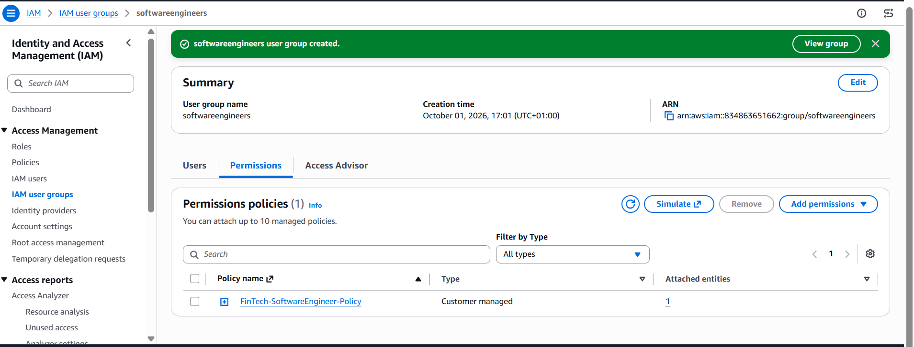
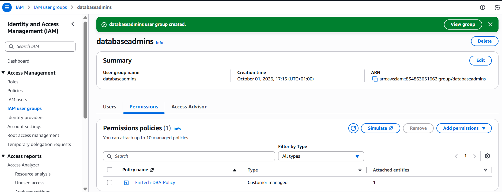
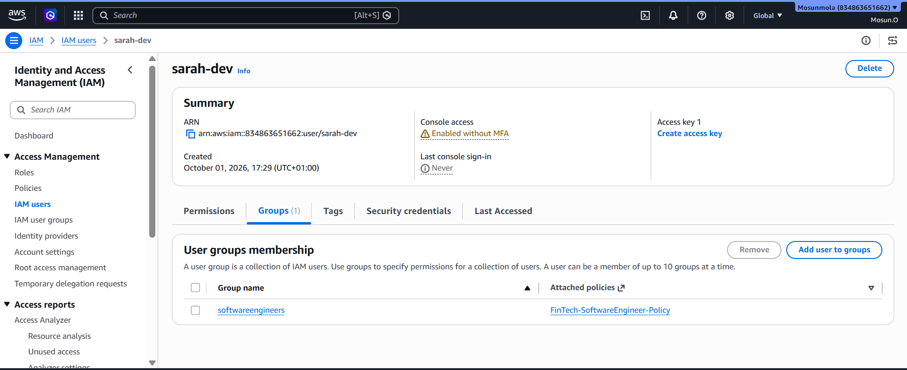
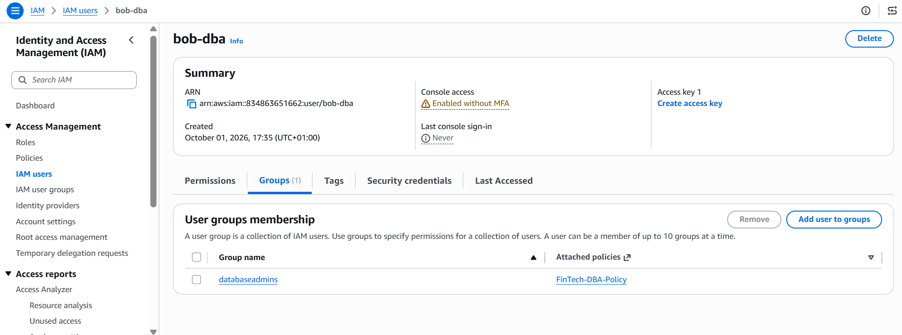
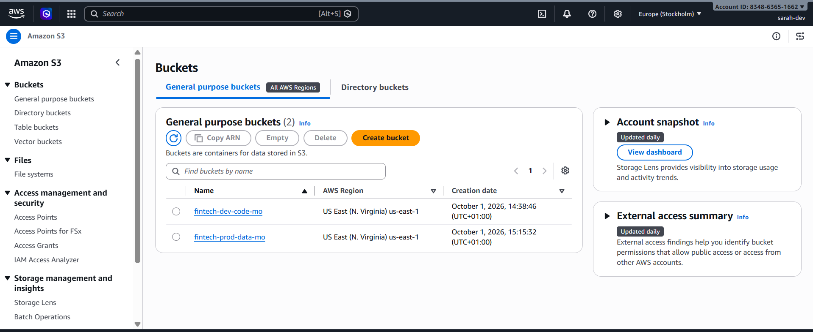
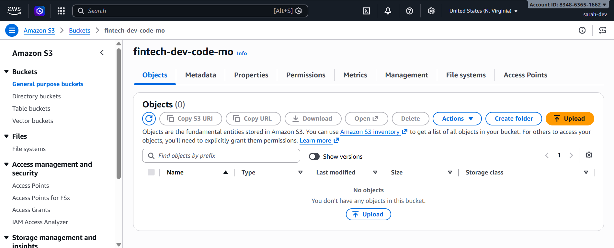
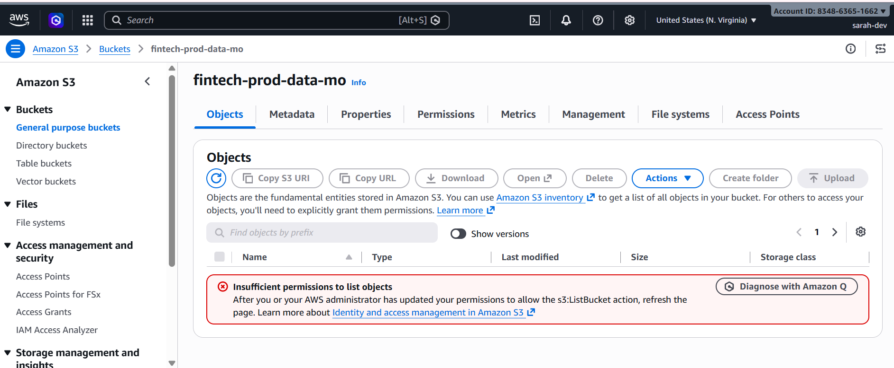
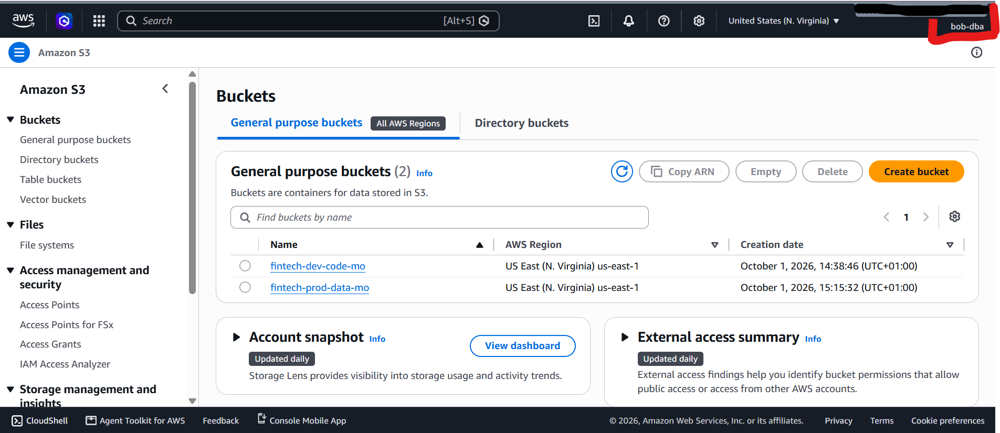
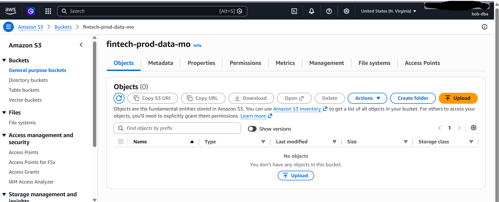
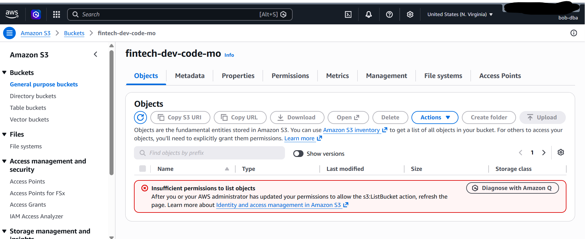

# FinTech Labs: IAM Modernization Implementation 
A hands-on AWS lab focused on designing, auditing, and securing an identity and access management framework for a growing fintech company.

## Why This Project Matters

In a fintech environment, effective identity and access management is critical because employees, applications, services, and workloads require controlled access to organizational resources.

A well-designed AWS IAM framework establishes who or what can access a resource, which actions they are permitted to perform, and under what conditions. This supports the Principle of Least Privilege (PoLP), reduces the risk of unauthorized access, strengthens accountability, and provides a structured approach to managing permissions as the organization grows.

## The Scenario:
FinTech Labs, a fast-growing financial technology startup, relies on a traditional on-premise "Castle-and-Moat" network security model in which security is largely based on protecting the organization's internal network perimeter where anyone inside the perimeter is trusted by default. 

Following a recent near-miss security incident where a developer's leaked password allowed an unauthorized script to touch customer records, executive leadership has mandated an immediate shift to an Identity-Centric, Zero Trust Security Model.

Design and implement a four-part IAM modernization proposal and security audit based on an identity-centric Zero Trust security model to support the secure migration of workloads from on-premises infrastructure to AWS

## Part 1: Identity Inventory & Taxonomy

- FinTech Labs has a mix of human and non-human users. Categorize the following entities into the correct IAM taxonomy buckets:
  
1. Sarah: A software engineer who writes backend payment APIs.
2. Payment-Gateway-API-Key: An automated token used by the server to talk to Stripe.
3. Alex: A customer service representative who handles support tickets.
4. Lambda-Log-Processor: An AWS serverless function that scrapes audit logs every hour.

**Categorizing the different entities**


| **Entity** | **IAM Taxonomy** | **Primary Security Risk if Compromised** | 
| ---------- | ------------ | -----    | 
| Sarah   | 	Workforce Identity  | An attacker could use her privileges to access internal systems or payment infrastructure, modify payment API code, pivot through CI/CD pipelines, depending on her assigned permissions
| Payment-Gateway-API-Key | Non-Human / Workload Identity | An attacker could use the stolen token to impersonate the payment integration to carry out fraudulent financial transactions and make unauthorized API calls to Stripe
| Alex | 	Workforce Identity | An attacker could gain access to the customer support systems to perform unauthorized actions, steal customers information and use it for social engineering against customers
| Lambda-Log-Processor | Non-Human / Workload Identity | An attacker could read sensitive audit data or other AWS resources available to its role, and if the role has write or delete permissions, it could erase evidence of their activities.


## Part 2: Designing a Least-Privilege Access Matrix (Authorization)


FinTech Labs has three primary sensitive resources:
- Res-Dev-Code (Source code repository)
- Res-Prod-Database (Customer financial records)
- Res-IAM-Console (Cloud administrative panel)


The engineering team currently has full admin access to everything; fix this using the Principle of Least Privilege (PoLP) and Separation of Duties (SoD), design an access matrix using None, Read, or Read/Write for the following roles to control access to sensitive FinTech Labs resources:


1. Software Engineer (Sarah)
2. Database Administrator (Bob)


**Create two separate cloud resources using S3 buckets as storage containers simulating the source code repo and the production databases**

- *Create the Dev code S3 Bucket*


- *Create the Prod Database S3 bucket*


- **Create custom least-privilege JSON policies to enforce Separation of Duties (SoD), ensuring that developers cannot access production data resources and vice versa**

- *Developer policy with permission to only the dev code resources*


[View the full JSON policy](dev-code-cloud-resources/fintech-software-engineer-policy.json)


- *Database administrator policy with permission to only the prod resources*


[view the full JSON policy](dev-code-cloud-resources/fintech-dba-policy.json)

- **Create user groups and assign policies to the groups. Attaching policies to groups that users belong to so that they inherit all the permissions of that group, rather than attaching policies directly to individual users follows best practices**

- *software engineers users group with the necessary policy attached*



- *database administrator users group with the necessary policy attached*



- *create users and add them to their respective groups*





**Log in to the AWS Console using each user’s credentials to test and verify their assigned permissions and authorized activities**

- *Sarah has permission to list all S3 buckets in the AWS account, she can view and upload objects in the fintech-dev-code-mo S3 bucket but she does not have permission to access the fintech-prod-data-mo S3 bucket. This access restriction is based on the Principle of Least Privilege (PoLP) and Separation of Duties (SoD) enforced through her group policy*







- *Bob has permission to list all S3 buckets in the AWS account, he can view and upload objects in the fintech-prod-data-mo S3 bucket but he does not have permission to access the fintech-dev-code-mo S3 bucket. This access restriction is based on the Principle of Least Privilege (PoLP) and Separation of Duties (SoD) enforced through his group policy*








## Part 3: Incident Investigation & Audit Analysis (Accounting)

An excerpt from the CloudTrail/Audit logs shows an authorized read of the production database. Use the logs to answer the following AAA-based forensic questions:

```
{
  "timestamp": "2026-09-24T02:14:05Z",
  "identity_type": "IAM Role",
  "principal": "arn:aws:iam::123456789:role/DevOps-Deployment-Role",
  "source_ip": "198.51.100.42",
  "action": "rds:DownloadDBClusterSnapshot",
  "status": "SUCCESS"
}
```

**Identification & Authentication:** 

- Did a human directly log in, or was a workload identity used? Which account/role was invoked?

*a workload identity, the DevOps-Deployment-Role IAM role in account 123456789 was used not a human log in**


**Authorization:**

 - Was the action permitted by default, or was there an explicit policy allowing it?

*the action was permitted by an explicit policy because IAM denies by default and the call succeeded* 


**Accounting/Forensics:**

- Based on the source IP and timestamp, what anomaly or red flag stands out that suggests a security incident?

*the anomalies were the timestamp (02:14 UTC) which is outside normal deployment hours; the source IP (198.51.100.42), which is external IP address; and the action, a snapshot download, which is data access rather than deployment behavior*


## Part 4: Executive Summary - The Zero Trust Transition Strategy:

Why the old network firewall (Castle-and-Moat approach) is no longer enough to protect FinTech Labs cloud infrastructure, and how shifting to Identity as the Perimeter solves the organization security gaps


 - **The Problem:**

The traditional Castle-and-Moat security model defends only the network boundary and trusts anything inside it. That no longer works for FinTech Labs. Users, workloads, APIs, and data are spread across cloud services, remote locations, and third-party systems, so no single perimeter exists. An attacker who gains one valid credential appears legitimate to the firewall and can move laterally to sensitive resources, as the recent unauthorized access to production data showed.


- **The solution:**

Identity as the Perimeter replaces network location with identity as the basis of trust. Every request is authenticated, authorized, and continuously evaluated against identity, role, device, workload, resource, and context. Access follows least privilege, and Separation of Duties (SoD) restricts who can touch production.
  

- **Implementation scope:**
- Centralized IAM with strong MFA
- Role-based access control and policy-based access
- Short-lived credentials and managed workload identities
- Full CloudTrail audit logging with continuous monitoring


- **Business outcome:**

- Reduced lateral movement, limited credential misuse, stronger visibility and accountability, and consistent access controls across cloud infrastructure.


## Skills Demonstrated

- AWS IAM — creating and managing users, groups, roles, and permissions.

- Least-Privilege Access Control (PoLP) — designing permissions that provide only the access required.

- Separation of Duties (SoD) — preventing conflicting roles from accessing sensitive production resources.

- AWS S3 Security — controlling bucket and object-level access.

- Role-Based Access Control (RBAC) — mapping permissions to job roles and responsibilities.

- Permission Testing & Validation — verifying what users can and cannot access through the AWS Console

- CloudTrail & Audit Logging — analyzing identity, authorization, source IP, timestamps, and API activity.

- Security Forensics — identifying anomalies and potential security incidents from audit logs.

- Zero Trust Architecture — applying Identity as the Perimeter rather than relying solely on network-based security.

- Cloud Security Architecture — designing security controls for distributed cloud environments.


