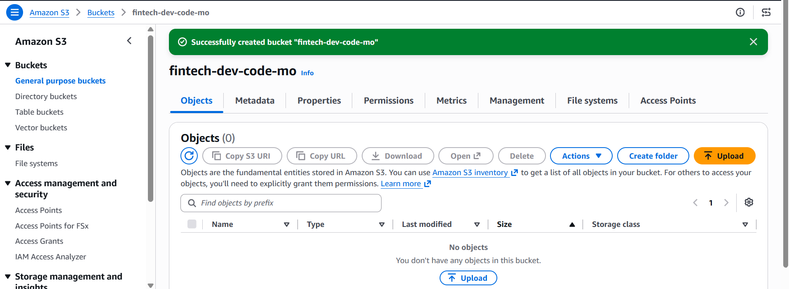
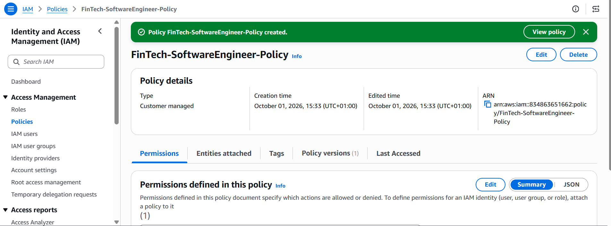
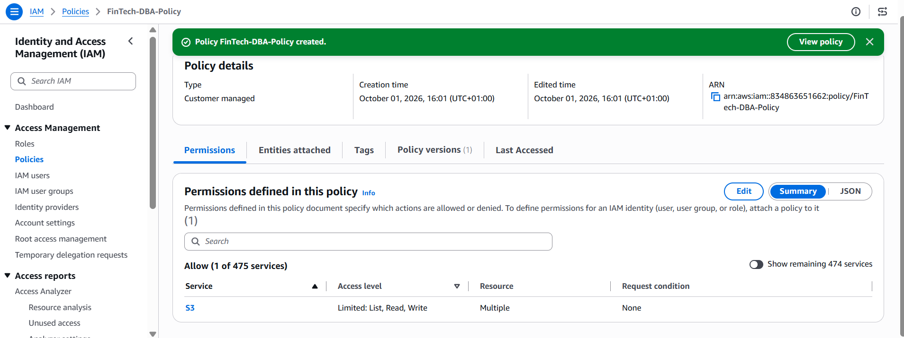

# The FinTech Labs - IAM Modernization Implementation 
A comprehensive hands-on AWS IAM lab focused on designing, auditing, and securing an identity and access management framework for a growing technology company.


## Why This Project Matters

In a fintech environment, effective identity and access management is critical because employees, applications, services, and other workloads require controlled access to organizational resources. A well-designed AWS IAM framework helps establish who or what can access a resource, which actions they are permitted to perform, and under what conditions. This supports the principle of least privilege, reduces the risk of unauthorized access, and provides a structured way to manage permissions as the organization grows.


## The Scenario:
FinTech Labs, a fast-growing financial technology startup, relies on a traditional on-premise "Castle-and-Moat" network security model in which security is largely based on protecting the organization's internal network perimeter where anyone inside the perimeter is trusted by default. 

Following a recent near-miss security incident where a developer's leaked password allowed an unauthorized script to touch customer records, executive leadership has mandated an immediate shift to an Identity-Centric, Zero Trust Security Model.

As the Lead IAM Security Engineer, design and implement a four-part IAM modernization proposal and security audit based on an identity-centric Zero Trust security model to support the secure migration of workloads from on-premises infrastructure to AWS

## Part 1: Identity Inventory & Taxonomy
- FinTech Labs has a mix of human and non-human users. Categorize the following entities into the correct IAM taxonomy buckets:
1. Sarah: A software engineer who writes backend payment APIs.
2. Payment-Gateway-API-Key: An automated token used by the server to talk to Stripe.
3. Alex: A customer service representative who handles support tickets.
4. Lambda-Log-Processor: An AWS serverless function that scrapes audit logs every hour.

- Task: Create a table listing each entity, identifying whether it is a Workforce Identity, Customer Identity, or Non-Human / Workload Identity, and defining its primary security risk if compromised.

**To categorize the different entities:**

| **Entity** | **IAM Taxonomy** | **Primary Security Risk if Compromised** | 
| ---------- | ------------ | -----    | 
| Sarah   | 	Workforce Identity  | An attacker could use her privileges to access internal systems or payment infrastructure, modify payment API code, pivot through CI/CD pipelines, depending on her assigned permissions
| Payment-Gateway-API-Key | Non-Human / Workload Identity | An attacker could use the stolen token to impersonate the payment integration to carry out fraudulent financial transactions and make unauthorized API calls to Stripe
| Alex | 	Workforce Identity | An attacker could gain access to the customer support systems to perform unauthorized actions, steal customers information and use it for social engineering against customers
| Lambda-Log-Processor | Non-Human / Workload Identity | An attacker could read sensitive audit data or other AWS resources available to its role, and if the role has write or delete permissions, it could erase evidence of their activities.

## Part 2: Designing a Least-Privilege Access Matrix (Authorization)
- FinTech Labs has three primary sensitive resources:
Res-Dev-Code (Source code repository)
Res-Prod-Database (Customer financial records)
Res-IAM-Console (Cloud administrative panel)
The engineering team currently has full admin access to everything. You need to fix this using the Principle of Least Privilege (PoLP) and Separation of Duties (SoD).

- Task: Design a clean access matrix using None, Read, or Read/Write for the following roles:
1. Software Engineer (Sarah)
2. Database Administrator (Bob)
3. DevOps Engineer (Dave)

**Create two separate cloud resources as storage containers simulating the source code repo and the production databases using S3 buckets**

- *Create the Dev code S3 Bucket*



- *Create the Prod Database S3 bucket*


- Write custom least-privilege JSON policies to enforce Separation of Duties (SoD), ensuring that developers cannot access production data resources and vice versa

- *Developer policy with permission to only the dev code resources*



```json
{
"Version": "2012-10-17",
"Statement": [
{
"Sid": "AllowConsoleListing",
"Effect": "Allow",
"Action": [
"s3:ListAllMyBuckets",
"s3:GetBucketLocation"
],
"Resource": "*"
},
{
"Sid": "AllowDevCodeAccessOnly",
"Effect": "Allow",
"Action": [
"s3:ListBucket",
"s3:GetObject",
"s3:PutObject"
],
"Resource": [
"arn:aws:s3:::fintech-dev-code-mo",
"arn:aws:s3:::fintech-dev-code-mo/*"
]
}
]
}
```

- *Database administrator policy with permission to only the prod resources*



```JSON
{
"Version": "2012-10-17",
"Statement": [
{
"Sid": "AllowConsoleListing",
"Effect": "Allow",
"Action": [
"s3:ListAllMyBuckets",
"s3:GetBucketLocation"
],
"Resource": "*"
},
{
"Sid": "AllowProdDataAccessOnly",
"Effect": "Allow",
"Action": [
"s3:ListBucket",
"s3:GetObject",
"s3:PutObject"
],
"Resource": [
"arn:aws:s3:::fintech-prod-data-mo",
"arn:aws:s3:::fintech-prod-data-mo/*"
]
}
]
}
```


